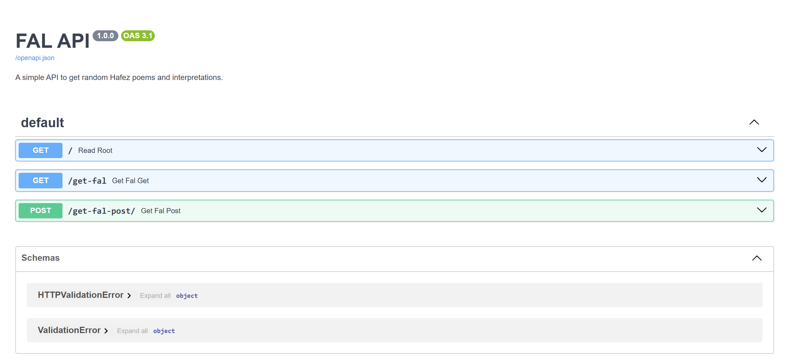

# 📜 FAL API — Hafez Divination Mini Project ✨🔮

A lightweight and fun **FastAPI** mini-project that serves **random Hafez fal** (poems + interpretations) from a simple `fals.json` dataset.  
Need a specific fal? Just request it by **ID**. Easy, clean, and made for learning 🚀

---

## 🧩 Features
- 🔮 **GET a random fal**
- 🆔 **Fetch fal by ID**
- 📨 **POST endpoint** that accepts ID from:
  - Query params
  - JSON body
- 📚 Built with **FastAPI** (automatic Swagger UI!) ✅
- 🎲 Returns structured JSON responses + friendly errors

---

## 🗂️ Project Structure
```txt
.
├── fal.py
├── fals.json
└── README.md
```

---

## ▶️ Run the Project

### 1) Clone
```bash
git clone https://github.com/YOUR_USERNAME/fal-api.git
cd fal-api
```

### 2) Install dependencies
```bash
pip install fastapi uvicorn
```

### 3) Start the server
```bash
uvicorn fal:app --reload
```

API base URL:
- http://127.0.0.1:8000

---

## 🧪 API Endpoints

### 🌟 `GET /`
Welcome message endpoint.

**Example**
```json
{
  "message": "Welcome to FAL hafez api ,you can Use /get-fal or /get-fal-post for poems."
}
```

---

### 🎲 `GET /get-fal?id={id}`
- If `id` is provided → returns the fal with that ID
- If `id` is omitted → returns a random fal

**Examples**
- Random:
  - `GET /get-fal`
- Specific:
  - `GET /get-fal?id=3`

---

### 📩 `POST /get-fal-post/?id={id}`
Accepts ID from either:
- `?id=...` (query param)
- or JSON body (if query param is missing)

If no valid ID is provided → returns a random fal.

**JSON Body Example**
```json
{
  "id": 10
}
```

---

## 📘 Swagger UI (API Docs)
FastAPI generates interactive documentation at:

- Swagger UI: http://127.0.0.1:8000/docs

### 🖼️ Swagger UI Screenshot
```md

```

---

## ⚙️ Data Source
All fal data is loaded from:
- `fals.json`

So you can easily add or update fal entries without changing code ✍️✨

---

## 🛠️ Tech Stack
- ⚡ FastAPI
- 🐍 Python
- 📦 JSON dataset (`fals.json`)
- 🎲 Random selection for `/get-fal` & fallback responses

---

## 🤝 Contributing
Contributions are welcome!  
Ideas:
- Add more endpoints
- Improve validation
- Add tests
- Enhance error format
- Add a nicer response schema

---

## 📜 License
MIT License — free to use and modify ✅

---
